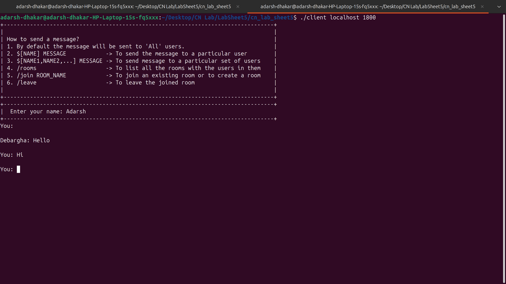
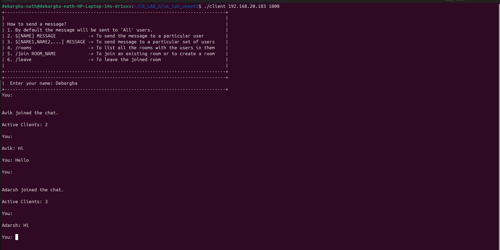
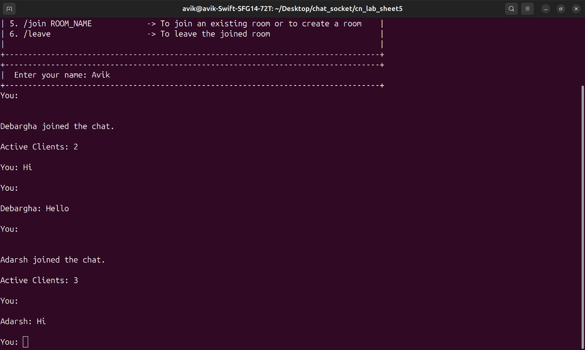
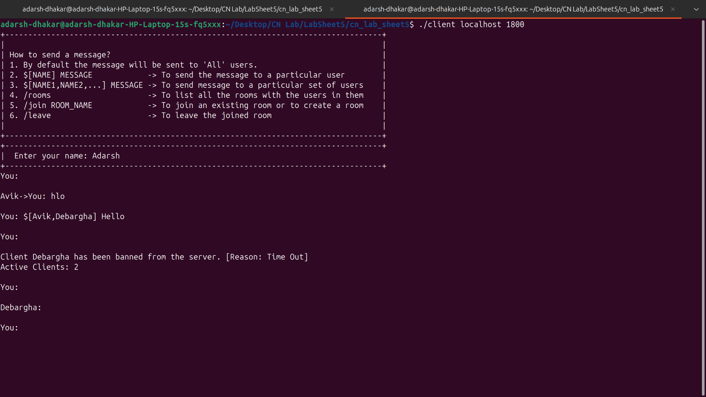

# Chat Server and Client using TCP Sockets 

## Table of Contents

- [Group Details](#group-details)
- [Required Links](#required-links)
- [File Structure](#file-structure)
- [Compilation & Execution](#compilation--execution)
- [Features](#features)
- [Additional Functionality](#additional-features)
- [Images](#images)
- [Submission](#submission)

## Group Details
- **Name:** [Adarsh Dhakar]  
  **Roll No:** [22CS01040]  
- **Name:** [Avik Sarkar]  
  **Roll No:** [22CS01060]  
- **Name:** [Debargha Nath]  
  **Roll No:** [22CS01070]  
- **Name:** [Soham Chakraborty]  
  **Roll No:** [22CS02002] 

## Required Links
- Github Link -> https://github.com/adarshdhakar/cn_lab_sheet5
- Zip File -> CN_LAB_SHEET5.zip
- Report Link -> /Report.pdf
- Images Folder -> /images

## File Structure
- `server_threaded.cpp` - Multi-client chat server using threads.
- `server_select.cpp` - Multi-client chat server using the `select()` system call.
- `client.cpp` - Chat client program.
- `README.md` - This file, containing details of the project.
- `images/` - Screenshots of the running server and clients on separate hosts.
- `report.pdf` - Contains group details, explanations, and additional functionalities.

## Compilation & Execution
The below procedure can either be followed after:
- cloning the repository or 
- downloading and extracting the zip 
- or just downloading the server and client files.

### Compiling the Server and Client
```bash
# Compile server using threads
g++ server_threaded.cpp -o server_thread -lpthread

# Compile server using select()
g++ server_select.cpp -o server_select

# Compile client
g++ client.cpp -o client
```

### Running the Server
```bash
./server_thread [PORT]
```
or
```bash
./server_select [PORT]
```

### Running the Client
```bash
./client [SERVER_IP] [PORT]
```

## Features
- Multiple clients can connect to the server simultaneously.
- Clients can send private messages to each other via the server.
- Clients can broadcast messages to all connected clients.
- Clients can join or disconnect from the chat without affecting others.
- Server handles client timeout and disconnections.

## Additional Features
- Timeout feature to detect inactive clients.

## Images
- **Server**  
<table>
    <tr>
    <td></td>
    <td></td>
    </tr>
</table>

- **Client1**  
<table>
    <tr>
    <td></td>
    <td></td>
    </tr>
</table>

- **Client2**  
<table>
    <tr>
    <td></td>
    <td></td>
    </tr>
</table>

- **Client3** 
<table>
    <tr>
    <td></td>
    <td></td>
    </tr>
</table>

## Submission
- All codes are included in a zip file.
- Report with explanations and images is attached.
- Github link for the same is provided.

